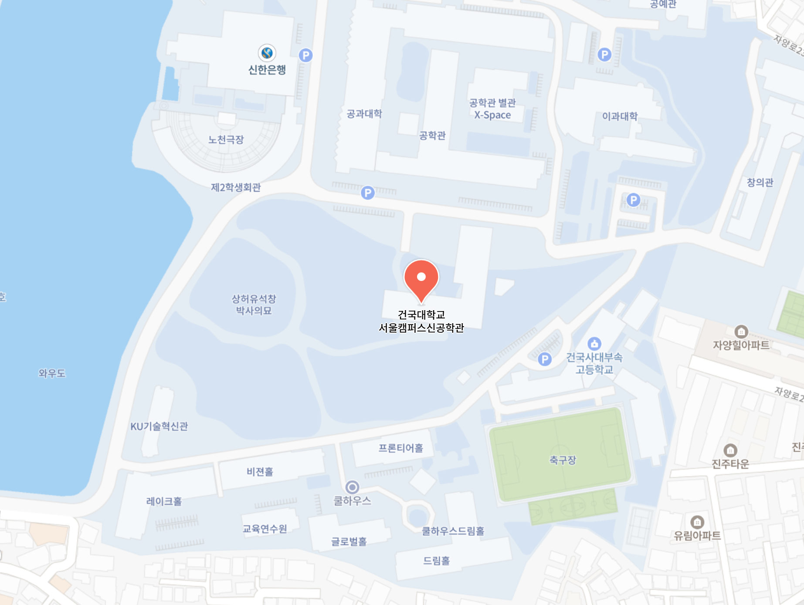

# Address

<!-- * 카카오맵 - 지도퍼가기 -->
<!-- 1. 지도 노드 -->
<div id="daumRoughmapContainer1726712126212" class="root_daum_roughmap root_daum_roughmap_landing"></div>

<!--
	2. 설치 스크립트
	* 지도 퍼가기 서비스를 2개 이상 넣을 경우, 설치 스크립트는 하나만 삽입합니다.
-->
<script charset="UTF-8" class="daum_roughmap_loader_script" src="https://ssl.daumcdn.net/dmaps/map_js_init/roughmapLoader.js"></script>

<!-- 3. 실행 스크립트 -->
<script charset="UTF-8">
	new daum.roughmap.Lander({
		"timestamp" : "1726712126212",
		"key" : "2koea",
		"mapWidth" : "640",
		"mapHeight" : "360"
	}).render();
</script>
```
120 Neungdong-ro, Gwangjin-gu, Seoul 05029. KOREA
```

## Office
```markdown
* DMS Lab: New Engineering Building 1207 (신공학관 1207호)
* Professor's Office: Engineering Building C 385 (공학관 C동 385호)
```
## Contacts
```markdown
- Email: dkmin at konkuk.ac.kr
- Phone: 02-450-3490
```