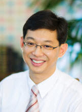

## Dugki Min (민덕기, 閔悳基) Ph.D

* Professor
* Computer Science and Engineering, College of Engineering

### Education
* B.S : 1986. Industrial Engineering, Korea University
* M.S : 1991. Computer Science and Engineering, Michigan State University
* Ph.D : 1995. Computer Science and Engineering, Michigan State University

### Research Interest
* Intelligent Multi Agent Systems
* Deep Learning and Deep Reinforcement Learning
* Internet of Things 
* Cyber Physical Systems 
* Digital Twin Systems 
* Big Data Processing and Analysis 
* Cloud and Fog Computing Systems
* Automative Provisioning and Proactive Operation/Management
* Distributed and Parallel Computing Systems
* Software Architecture 
* Performance and Dependability Analysis

### Teaching
* Distributed Computing and Systems (Distributed System Concepts, Hadoop, Blockchain)
* Next Generation Distibuted Systems (Cloud Computing, Virtualization, Docker, OpenStack, Kubernetes, GPU)
* Open Source SW Project 1 (Deep Learning, Tensorflow, PyTorch)
* Open Source SW Project 2 (Deep Reinforcement Learning, PyTorch)
* Software Design Methodology (Object-Oriented Anaysis and Design, UML, Unified Process)
* Software Architecture (Architecture Design Methodology, Architecture Styles and Tactics, in Samsung Electronics(2016-2020))
* Deep Reinforcement Learning Basic 
* Advanced Deep Reinforcement Learning

### Professional Activities
* 1995-present Full Professor, Computer Science and Engineering, College of Engineering, Konkuk University
* 2021-present Chairman, Department of Artificial Interlligence, Graduate School, Konkuk University
* 2008~present Steering Committee Member, Korea Software Technology Association 
* 2020-2021    Visiting Professor,Lecturer, Pacific States University, LA, USA
* 2016-2020   Lecturer, Associate Architecture Course, Samsung Electronics Co.,Ltd
* 2018-2020   Chairman, Department of Computer Science and Engineering, College of Engineering, Konkuk University
* 2018-2020   Divisio Head, Division of Information and Computer, Graduate School of Education., Konkuk University
* 2016-2020   Division Head, Division of IT Supervision, Graduate School of Information and Communications, Konkuk University
* 2007~2019 Committee Member, Korea Society of IT Services
* 2005~2019 Committee Member, Korea Society of Simulation
* 2010-2011   Visiting Professor, Vanderbilt University, TN, USA
* 2006~2010   Co-Chair, WSQM TC, Organization for the Advancement of Structured Information Standards (OASIS-OPEN.org)
* 2004~2010   Vice President, Korea Software Modeling Technology Forum
* 2005~2009:  Vice Chair, WSQM TF, National Information Society Agency
* 2003~2008:  Vice President, KSIG, OMG Standard Organization (OMG.org)
* 2006~2007:  Research Fellow, Korea Software Industry Promotion Agency
* 2002~2005:  Chair of Technical Committee, Korea Component Standardization Forum
* 2003~2004:  Technical Advisory Committee Member, Web Service Planning Team, Ministry of Information and Communication
* 2000~2003:  Chief Technology Officer, Two-Way Communication, Co.

### Contact
* Office : Room 385, Engineering Building C
* Lab : Room 1207, New Engineering Building
* E-Mail: dkmin at konkuk domain
