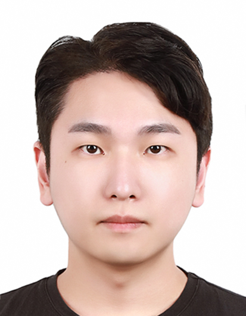

## JungHyun Park (박정현, Team CV / MS)

### Research Interests
- Artificial Intelligence / Deep Learning / Computer Vision / Object Detection / Vision Large Language Model / Multi-modal 
- Autonomous Driving / Generative AI / Parameter Efficient Fine-Tuning / Data Science
 
### Contact Info
Lab: Room 1207, New Engineering Building
email: knlight@konkuk.ac.kr / mmkndark@daum.net
Phone: 010-4517-9307
 
### Related Links
- [Github](https://github.com/PJH33)
- [Velog](https://velog.io/@knlight/posts)
- [Tistory](https://www.tistory.com/member/blog)
