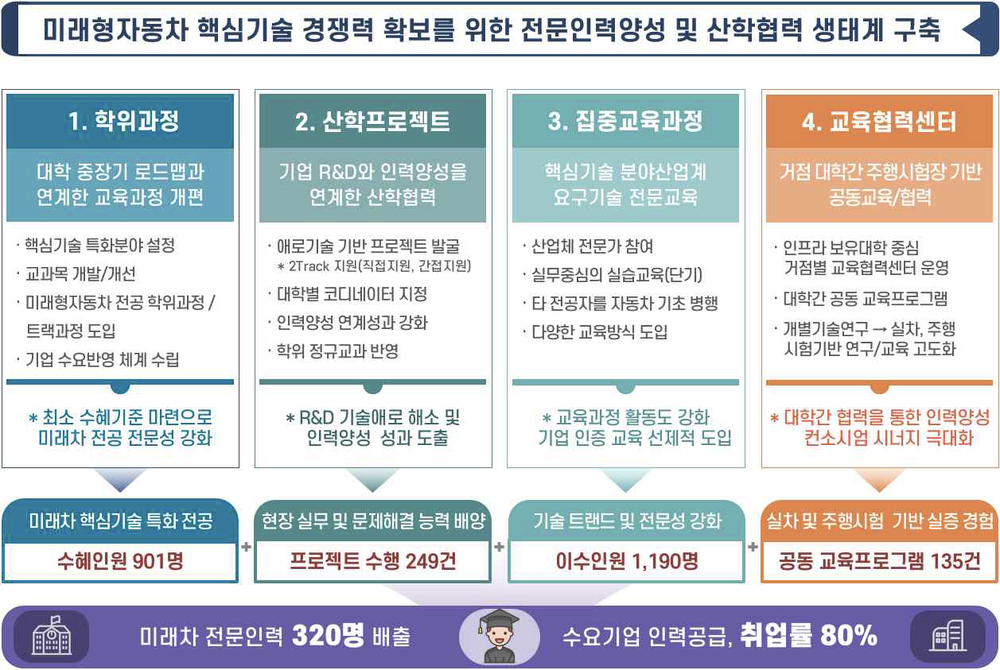

◉ The automotive industry is undergoing a paradigm shift towards future mobility, including autonomous driving, connected cars, and electric vehicles. However, there is a significant skills gap between the current workforce and the expertise required for these emerging technologies.

◉ This project aims to cultivate high-level R&D professionals specializing in core technologies for future automobiles through a comprehensive industry-academia collaboration program.

    ▶ Develop and operate specialized graduate-level curricula focused on autonomous driving, connected car technologies, and automotive software engineering across 9 participating universities.

    ▶ Conduct industry-academia joint research projects to enhance students' practical skills and solve real-world technical challenges faced by companies.

    ▶ Operate intensive training programs on industry-demanded skills and tools to strengthen students' technical expertise in future automobile technologies.

    ▶ Establish 3 regional education cooperation centers with driving test facilities to provide hands-on experience and advanced training.

◉ The project will leverage the specialized research infrastructure and industry-academia networks of participating institutions to nurture R&D talent and contribute to innovation in the future automobile industry.

◉ Through this initiative, we aim to address the current skills shortage, align with global leaders in automotive technology, and cultivate the next generation of experts who will drive innovation in the future mobility sector.

Key Information:
- Funded by: Ministry of Trade, Industry and Energy  
- Duration: March 1, 2022 - February 28, 2027 (5 years)
- Target: Cultivate 320 specialized graduate-level professionals annually
- Participating Universities: 9 universities nationwide