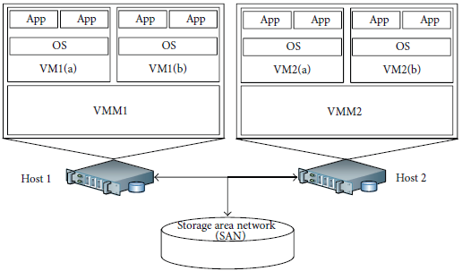
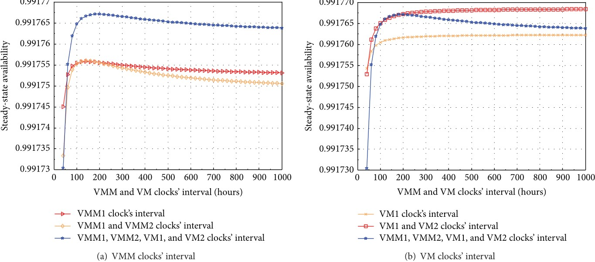
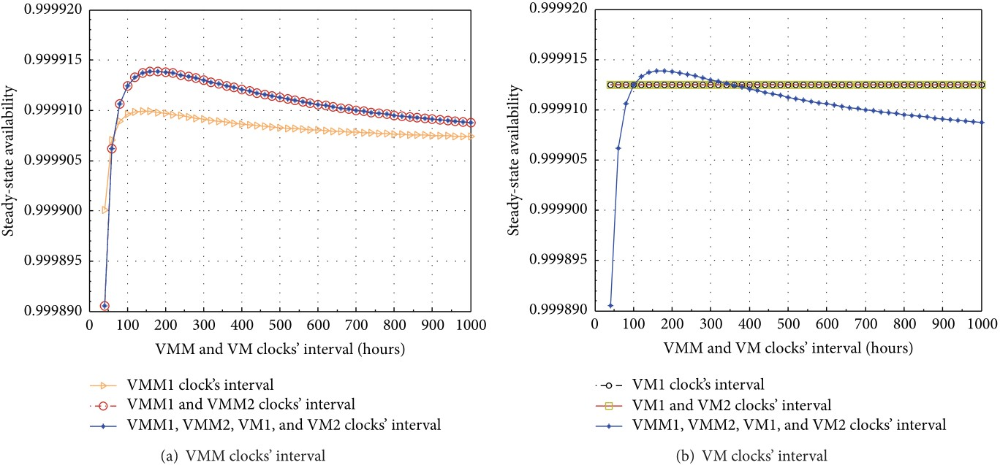

# Research on Virtualized Servers Systems

### Abstract

It is important to assess availability of virtualized systems in IT business infrastructures. Previous work on availability modeling and analysis of the virtualized systems used a simplified configuration and assumption in which only one virtual machine (VM) runs on a virtual machine monitor (VMM) hosted on a physical server. In this research, we show a comprehensive availability model using stochastic reward nets (SRN). The model takes into account (i) the detailed failures and recovery behaviors of multiple VMs, (ii) various other failure modes and corresponding recovery behaviors (e.g., hardware faults, failure and recovery due to Mandelbugs and aging-related bugs), and (iii) dependency between different subcomponents (e.g., between physical host failure and VMM, etc.) in a virtualized servers system. We also show numerical analysis on steady state availability, downtime in hours per year, transaction loss, and sensitivity analysis. This model provides a new finding on how to increase system availability by combining both software rejuvenation at VM and VMM in a wise manner.

### A virtualized servers system (VSS)

The architecture of a typical virtualized servers system (VSS) with multiple VMs is depicted in Figure 1. The VSS consists of two physical servers (also called hosts, host1 and host2). Both hosts have an identical configuration. Each host has a VMM (which is also known as hypervisor) and each host runs two VMs on its VMM. Each VM subsystem is composed of an operating system (OS) and multiple identical applications (Apps) as wanted. In this research, we disregard the involvement of OS, Apps, and workload. The hosts share a storage area network (SAN) on which the VM images or VMM source code files are stored. We will be using this system to study availability of a virtualized system. The model can be further extended in the future, but our focus is to take into account the detailed behaviors of a virtualized system, in contrast to incorporating a large scale cloud system.

**Figure 1: Architecture of a Virtualized Servers System (VSS)**

**Figure 2: Stochastic Reward Net Models of a VSS**

**Figure 3: SSA sensitivity analysis of VM subsystem with respect to VMM and VM clocks’ interval.**

### Remarks

We have modeled and analyzed a virtualized servers system with multiple VMs via SRN. We encapsulated four VMs running on two VMMs into two hosts. We also incorporated diverse failure modes and corresponding recovery behaviors regarding hardware and software aspects including host failure, SAN failure, aging-related failure, and Mandelbugs related failure in SRN models. A variety of dependencies were taken into account in modeling as follows: (i) dependencies between a host and its hosted VMM, in turn between the VMM and its hosted VMs; (ii) interconnection dependency between SAN and VM subsystems; and (iii) marking dependency between VMs in a host. The SSA analysis showed that a frequent rejuvenation policy on VM may lower the SSA of the virtualized systems whereas that on VMM may enhance the system SSA. Based on the sensitivity analysis with respect to SSA, we showed that adopting a particular combination of rejuvenation on all VMM and VM subsystems in both hosts with the value of common interval in a specific range may help to increase system availability of the virtualized system.
