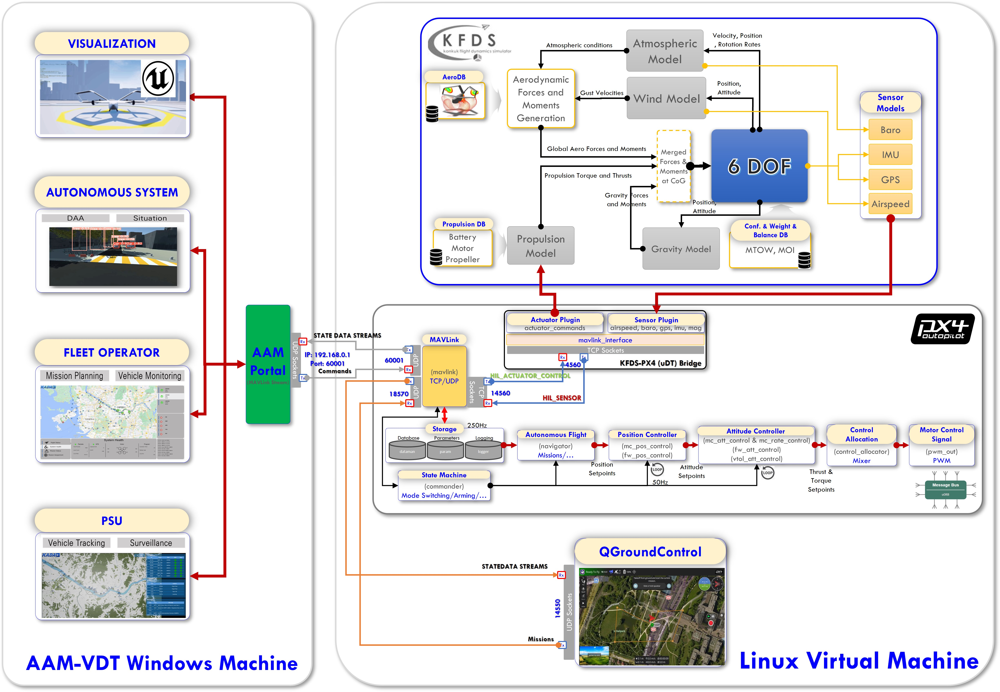
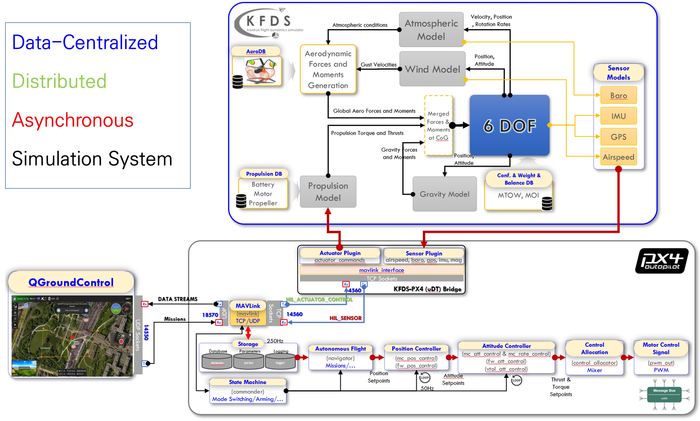

---------------------------------------

# Pilot-in-the-loop simulation with virtual reality (PILS-VR) running on top of cloud-in-the-loop simulation (CILS)

I am excited to share the progress our team has made in a short period. It was an honor to represent our group at the Conference on Automation, Control, and Robotics Engineering (CACRE 2024) in Jeju. Our collaboration with Korean students, combined with the relentless efforts of our Vietnamese team at KADA, has led to remarkable developments. 

In a short time, we have successfully expanded our Pilot-in-the-Loop Simulation (PILS) system by integrating it with Virtual Reality (VR) on the Cloud-in-the-Loop Simulation (CILS) platform. A special thanks to my colleagues: Dr. Vinh Vinh Phạm, Nghĩa, and Nguyễn Viết Nghĩa. Please excuse the rudimentary graphics as our focus wasn't on 3D development.

## PILS-VR System Overview

[Watch our video on the latest in aviation simulation technology: the Pilot-in-the-Loop Simulation with Virtual Reality (PILS-VR)](https://youtu.be/_kyAtntDHmc)

In this video, we showcase our innovative system developed at the Konkuk Aerospace Design Airworthiness Institute (KADA). We've successfully integrated PILS with our Cloud-in-the-Loop Simulation (CILS) system, built on the KP-2 platform for Future Advanced Air Mobility (AAM).

**Highlights of PILS-VR:**

- **Realistic VR Training:** Experience a highly immersive training environment that simulates real-world flight conditions and emergency scenarios.
- **Cloud-Based Flexibility:** Seamless integration with CILS enables remote access, real-time data analysis, and collaborative training, enhancing flexibility and efficiency.
- **Cost-Effective Solutions:** Reduce traditional training costs and increase accessibility with our advanced VR and cloud technologies.
- **Personalized Feedback:** Benefit from detailed performance tracking and tailored feedback to accelerate learning and improve skills.

Join us to see how PILS-VR is revolutionizing pilot training and setting new standards in aviation safety.

### Data Exchange Method Development

[Watch our video on the method to extract data exchanged between KFDS and PX4 during simulation run-time](https://www.youtube.com/watch?v=1BYQKzVgXeQ)

Using this method, we can input control signal data from pre-existing files into KFDS, which then loads these control data according to the predetermined times specified in the files. Subsequently, the flight state data generated by KFDS are recorded for validation or virtual certification purposes.

### (p/d) Twin Data Center

[Watch our video on Twin Data Center](https://youtu.be/byyYU9jCaTk)

All data from KFDS and PX4 are collected in run-time simulation for further analysis and prediction for future updates of digital twin models in the virtual world.

<!-- <html lang="en">
<body>

<iframe src="https://www.youtube.com/embed/ePH-f1H2PH8" frameborder="0" allow="accelerometer; autoplay; clipboard-write; encrypted-media; gyroscope; picture-in-picture" allowfullscreen></iframe>
<iframe src="https://www.youtube.com/watch?v=1BYQKzVgXeQ" frameborder="0" allow="accelerometer; autoplay; clipboard-write; encrypted-media; gyroscope; picture-in-picture" allowfullscreen></iframe>
<iframe src="https://www.youtube.com/watch?v=byyYU9jCaTk" frameborder="0" allow="accelerometer; autoplay; clipboard-write; encrypted-media; gyroscope; picture-in-picture" allowfullscreen></iframe>

</body>
</html> -->

---------------------------------------

#  Advanced Air Mobility-Vehicle Digital Twin (AAM-VDT) 

Excited to share our achievements after a year of leading the AAM-VDT project at Konkuk Aerospace Design-Airworthiness Institute (KADA). We've made significant progress in developing an integrated simulation platform for the Konkuk Passenger Vehicle (KP-2) digital twin in the Advanced Air Mobility (AAM) sector. Our focus on cutting-edge technologies has paved the way for a revolutionary system in urban air mobility.

The Advanced Air Mobility-Vehicle Digital Twin (AAM-VDT) project integrates cloud computing, artificial intelligence, and simulation to manage heterogeneous vehicles in real-time. Our collaboration within the KADA Research Groups - Design and Analysis, Simulation and Control, and AI Applications - has been instrumental in achieving our goals.

Our key features include cloud server integration, AI-driven operations, digital twin technology, and a strong emphasis on operational safety and management. By utilizing digital twin dynamics, ensuring safety and reliability, and implementing multi-vehicle coordination, we are shaping the future of AAM operations.

## Medias

- [VDT Simulation System](https://youtu.be/ePH-f1H2PH8)
- [VDT Concept Illustration](https://youtu.be/9effNK__aOU)
- [VDT Simulation in KU Map (01)](https://youtu.be/X20FuC0C7pM)
- [VDT Simulation in KU Map (02)](https://youtu.be/huKKna1OFjA)
- [VDT Simulation in Seoul Map (Fixed Wing)](https://youtu.be/luD0U2uVrgg)
- [VDT Simulation Scenarios](https://youtu.be/QfZZfo9YNls)
- [KP2C Real Flight Test](https://youtu.be/qfMXk1IYKFA)
- [KP2C es-DNLC Flight Test](https://youtu.be/u0xFRdc-97Q)
- [KP2C LQR Flight Test](https://youtu.be/FqyS67FReXo)

Special thanks to our diligent KADA engineers and researchers! Jeongseok Hyun, Minseok Jang, Taeho Kwag, Nghia Nguyen, Vinh Pham, AYE AYE MAW

Excited about the possibilities that lie ahead as we continue to innovate and drive advancements in the realm of Advanced Air Mobility. #AAM #UAM #DigitalTwin #AI #CloudComputing

<html lang="en">
<body>

<figure>
    
    <figcaption>VDT Technologies of KADA</figcaption>
</figure>
<figure>
    
    <figcaption>VDT Simulation System for Demonstration</figcaption>
</figure>
<figure>
    
    <figcaption> VDT Cloud in the loop simulation (CILS) </figcaption>
</figure>
<figure>
    
    <figcaption>VDT Single Vehicle integrated with operational digital twin (ODT)</figcaption>
</figure>
<figure>
    
    <figcaption>VDT software in the loop simulation (SITL)</figcaption>
</figure>
<figure>
    
    <figcaption>VDT PX4-KFDS SITL with Bridge</figcaption>
</figure>

-------------------------

<iframe src="https://www.youtube.com/embed/ePH-f1H2PH8" frameborder="0" allow="accelerometer; autoplay; clipboard-write; encrypted-media; gyroscope; picture-in-picture" allowfullscreen></iframe>
<iframe src="https://www.youtube.com/embed/9effNK__aOU" frameborder="0" allow="accelerometer; autoplay; clipboard-write; encrypted-media; gyroscope; picture-in-picture" allowfullscreen></iframe>
<iframe src="https://www.youtube.com/embed/X20FuC0C7pM" frameborder="0" allow="accelerometer; autoplay; clipboard-write; encrypted-media; gyroscope; picture-in-picture" allowfullscreen></iframe>
<iframe src="https://www.youtube.com/embed/huKKna1OFjA" frameborder="0" allow="accelerometer; autoplay; clipboard-write; encrypted-media; gyroscope; picture-in-picture" allowfullscreen></iframe>
<iframe src="https://www.youtube.com/embed/luD0U2uVrgg" frameborder="0" allow="accelerometer; autoplay; clipboard-write; encrypted-media; gyroscope; picture-in-picture" allowfullscreen></iframe>
<iframe src="https://www.youtube.com/embed/QfZZfo9YNls" frameborder="0" allow="accelerometer; autoplay; clipboard-write; encrypted-media; gyroscope; picture-in-picture" allowfullscreen></iframe>
<iframe src="https://www.youtube.com/embed/qfMXk1IYKFA" frameborder="0" allow="accelerometer; autoplay; clipboard-write; encrypted-media; gyroscope; picture-in-picture" allowfullscreen></iframe>
<iframe src="https://www.youtube.com/embed/u0xFRdc-97Q" frameborder="0" allow="accelerometer; autoplay; clipboard-write; encrypted-media; gyroscope; picture-in-picture" allowfullscreen></iframe>
<iframe src="https://www.youtube.com/embed/FqyS67FReXo" frameborder="0" allow="accelerometer; autoplay; clipboard-write; encrypted-media; gyroscope; picture-in-picture" allowfullscreen></iframe>

</body>
</html>

<html lang="en">
<body> 

 </body>
</html>

-------------------------------

# Digital Twin Requirements

It is required to develop a vehicle digital twin (DT) for urban air mobility (UAM) which relies on an accurate, physics-based emulator to characterize the statics and dynamics of a vehicle. Because, the adoption of digital twin in operations and control of the vehicle is necessary for the UAM operational digital twin infrastructures (UAM-ODT). The issues are: (i) lack of digital twin engines for the digitalization (twinization) of dynamics and control of UAM vehicle running at the core center of UAM-ODT systems; and (ii) lack of back-end system engineering in the development of UAM vehicle DT. In that regard, our research proposes and discusses on an engineering direction for the development of UAM vehicle DT engines and systems.

# Introduction

Innovative DT technology has the potential to transform a number of expanding industries. In DT, the idea of incorporating physical-twin-specific calculations into a feedback loop of data-driven analysis and dynamically updated decision-making is introduced. DTs are collections of connected computational models that progressively change state-spaces over time to mimic the underlying structure, behaviours, and environment of their physical counterparts [1,2]. This research presents a study on how the UAM vehicle DT can be developed by proposing fundamental engines for the transformation of dynamics and control of a UAM vehicle from real to digital spaces.

# UAM Vehicle Digital Twinization Engines

The overall architecture of an UAM-ODT entails four fundamental modules, as shown in Fig. 1: (i) neural digital twin dynamic engines (DTDE), (ii) neural digital twin control engines (DTCE), (iii) digital twin control frame, and (iv)  (DTCI) cloud infrastructure. The DTDE module uses learning-based approaches to duplicate the UAM cars' aerodynamics. DTCE module handles the control duties, whereby robust control, optimum control, and adaptive control may be produced for the vehicle's safety.

**Fig. 1. UAM Vehicle Digital Twinization Engines**

These two components will digitalize the vehicle's dynamics and control, ensuring that its operations in both the digital and physical worlds may be exact replicas of one another. The DTCF module is designed to provide a DT bridge connecting the vehicle's physical and DTs. This module can offer tele-operation services, fault-tolerant control, or traffic prediction and management. Without loss of generality, if the physical vehicle's dynamics and control are accurately represented in the digital space, along with the digital environment (such as cities, regions, and countries), the operations in the digital space can be successfully applied to the physical space. The UAM-ODT system as a whole runs continuously on the DTCI module to create a virtual representation of the actual UAM physical infrastructure.

# Digital Twin Dynamics Engine (DTDE)

To twinize the dynamics of a vehicle, we develop a deep learning based dynamics engine in the form of a deep neural network (DNN) which can capture the real behaviors of vehicle dynamics as shown in Fig. 2. The DNN (Fig. 2 (a)) is trained upon the real flight test data in manual control mode to capture the correlation between the control input and the response states, which is the real vehicle dynamics.

*(a) Neural Dynamics Engine*

*(b) Transfer Learning for Fidelity Improvement*

*(c) Dynamics prediction*

**Fig. 2: Digital Twin Dynamics Engines (DTDE)**

Transfer learning (Fig. 2 (b)) is used to enhance the coverage of training data and to improve the fidelity of dynamics engine. Since the simulation models from different levels of fidelity can provide sufficient operational flight modes. Preliminary results in Fig. 2 (c) show that the approach can apparently clone the flight dynamics of the vehicle both based on simulation data and real flight test data of hexa-copter drone “Sundori” and KP-01 eVTOL vehicle under development in Konkuk Aerospace Design-Airworthiness Institute (KADA), Konkuk university, Seoul, South Korea.  

# Digital Twin Control Engine (DTCE)

Control algorithms of the real vehicle are encapsulated in the DTCE module which includes (i) robust control, es-DNLC [3], a deep neural network control with exponentially stabilizing control Lyapunov functions for attitude stabilization of PAVs in Fig. 3 (a), (ii) optimal control, tilting optimization using reinforcement learning in Fig. 3 (b) to find optimal strategy for tilting scheduling during transition mode, (iii) adaptive control in Fig. 3 (c), which is to optimize control parameters using Bayesian optimization approach and Gaussian processes for dynamics representation.
The preliminary results in Fig. 3 (d) show that our approach using deep learning based control with Lyapunov stability can guarantee a high level of robustness for operational flights (attitude stabilization) of the UAM vehicle KP-01.

*(a) es-DNLC*

*(b) Tiltiing Optimization using RL*

*(c) Bayesian optimization of controller*

*(d) Preliminary results of deep neural Lyapunov control*

**Fig. 3: Digital Twin Control Engine (DTCE)**

# Digital Twin Control Frame (DTCF)

It is believed that the DTDE, and DTCE can capture exactly how the physical vehicle can fly in the real space. At this time, the control in the digital space can be adopted for the real-world operations of the physical vehicle in the physical space. Tele-operations and fail-safe flights can be developed through the DTCF module in Fig. 4.  A bridge for virtual-real space connection is developed using MAVLink API to transmit and receive aerospace data between the physical-digital vehicles in asynchronous and irregular manner.

**Fig. 4: Digital Twin Control Frame (DTCF)**

# Digital Twin Cloud Infrastructure (DTCI)

The above modules are for the DT development of a single UAM vehicle. To develop the UAM-ODT system for a huge number of vehicles, a cloud infrastructure is involved for the deployment of nucleus cores of **[dynamics and control]** of heterogeneous vehicles/

# Remarks

This research proposes and discusses an overall engineering direction for the development of UAM vehicle digital twin system. Preliminary results prove that the approaches can clone the dynamics and control of UAM vehicles for the development of UAM-ODT.

-----

# References

[1] T.A. Nguyen, S.W. Jeon, A.A. Maw, D.K. Min, J.W. Lee, (2020), “Toward dependable blockchain and AI engines of digital twin systems for urban air mobility”, The Korean Society for Aeronautical & Space Sciences, 한국항공우주학회 학술발표회 초록집, 2021.07, 408-409.

[2] T.A. Nguyen, J. Li, M. Jang, A.A. Maw, V. Pham, J.W Lee, (2022), “Cloud-in-the-loop simulation: A cloud-based digital twin HW/SW framework for multi-mode AI control simulation of eVTOL KADA-UAM Personal Aerial Vehicles”, The Korean Society for Aeronautical & Space Sciences, 한국항공우주학회 학술발표회 초록집, 2022.04, 138-139.

[3] M. Jang, J. Hyun, T.A. Nguyen, J.W. Lee, (2022), “Attitude Stabilization of eVTOL in Hovering Mode using Neural Network based Control with Lyapunov Theorem”, The Korean Society for Aeronautical & Space Sciences, 한국항공우주학회 학술발표회 초록집, 2022.04, 322-323.
