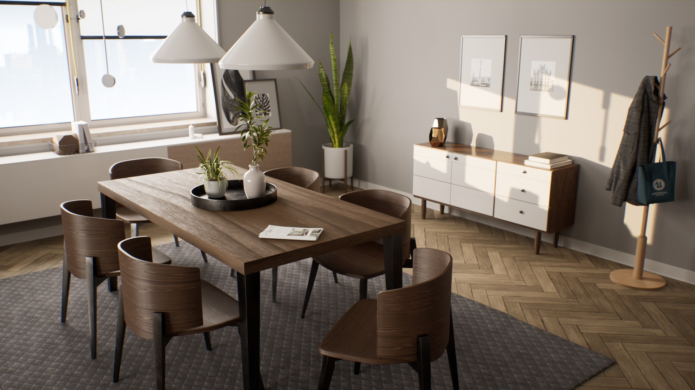

## DRL(Deep Reinforcement Learning) based Obscacle Avoidance

- Our research in **DRL (Deep Reinforcement Learning) based Obstacle Avoidance** leverages modern reinforcement learning techniques to enable agents to navigate complex environments while avoiding obstacles. We implement advanced algorithms such as **DQN (Deep Q Network)**, **DDPG (Deep Deterministic Policy Gradient)**, and **PPO (Proximal Policy Optimization)** to train agents to make optimal decisions in dynamic scenarios.
- These methods allow the agent to learn through interaction with the environment, continuously improving its ability to avoid both static and moving obstacles in real-time, leading to safe and efficient navigation.

Ref: https://github.com/tomasvr/turtlebot3_drlnav/blob/main/media/simulation.gif

## Leveraging Vision Technology for Navigation

- Our research in **SLAM (Simultaneous Localization and Mapping)** focuses on building indoor maps using **RGB-D sensors** combined with advanced models like **CNN**, **Vision-Transformer**, and **CLIP**. These models enable the segmentation of various indoor instances such as sofas and beds.
- The segmented data is used to generate **BEV (Bird's Eye View) maps**, which are essential for effective indoor navigation by providing a structured representation of the environment.

Ref: https://devendrachaplot.github.io/projects/resources/semexp.gif

## Research on Digital Twin

- Our research on **Digital Twins** leverages **ROS (Robot Operating System)** for simulation, and we are enhancing realism by building a more accurate Digital Twin using **Unreal Engine**. This allows us to create a virtual environment that closely mirrors the real world for advanced navigation research.

[https://www.unrealengine.com/marketplace/en-US/product/archvis-interior-rendering](https://www.unrealengine.com/marketplace/en-US/product/archvis-interior-rendering)

- Simultaneously, we are working on real-world mobile robot applications by integrating **embedded boards**, such as **Jetson Nano**, with sensors like **Lidar** and **RGB-D cameras**. A key focus is on **sensor fusion**, combining data from multiple sensors to improve the robot’s perception and navigation capabilities in complex environments.

## Related works

- [GOAT](https://theophilegervet.github.io/projects/goat/); **GO** to **A**ny **T**hing: Object Goal Navigation using Goal-Oriented Semantic Exploration
- [Semantic MapNet](https://arxiv.org/abs/2010.01191): Building Allocentric Semantic Maps and Representations from Egocentric Views
- [Trans4Map](https://arxiv.org/abs/2207.06205): Revisiting Holistic Bird’s-Eye-View Mapping from Egocentric Images to Allocentric Semantics with Vision Transformers