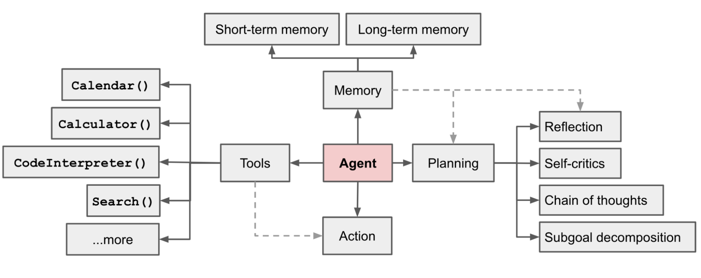

# Research on Natural Language Processing
Natural Language Processing (NLP) is a cutting-edge field of AI that focuses on enabling computers to understand, interpret, and generate human language. Our NLP AI team is at the forefront of this exciting domain, currently delving into advanced research areas such as LLM Agent prompt optimization techniques, Parameter-Efficient Fine-Tuning (PEFT) methods for large language models, and the development of an innovative LLM Agent for Silvercare Assistant.

NLP team's research efforts are multifaceted, encompassing several key areas. We are developing sophisticated prompt optimization techniques that leverage Small Language Models as prompt generators, exploring the potential of Direct Preference Optimization (DPO) for efficient fine-tuning, and implementing Low-Rank Adaptation (LoRA) to achieve efficient model adaptation. Additionally, we are designing complex multi-agent systems for intricate NLP tasks and enhancing the memory capabilities of LLM Agents to improve their overall performance and interaction quality.

## LLM Agent for Silvercare Assistant
The LLM Agent for Silvercare Assistant, represents a significant leap forward in AI-assisted elderly care. This innovative system is designed to provide comprehensive support for seniors, integrating advanced natural language processing capabilities with personalized care features.

ref: https://lilianweng.github.io/posts/2023-06-23-agent/

## LLM Agent Prompt Optimization Research
Our recent research focuses heavily on LLM agent prompt optimization, an area that has seen significant advancements in recent years. We've been closely following the developments presented at conferences like ACL 2023, where groundbreaking papers introduced methods such as Auto-CoT and Expert Prompting.

Building on these foundations, we've proposed a novel prompt optimization method that utilizes Small Language Models (LMs) as prompt generators. This approach is combined with Direct Preference Optimization (DPO), leveraging its advantages over traditional Proximal Policy Optimization (PPO) methods. Our method aims to achieve superior performance while reducing computational requirements compared to using large-scale models like GPT.

We've also delved into the theoretical underpinnings of Preference Learning, exploring models such as Bradley-Terry, DPO, and PRO. Our discussions have included detailed mathematical expressions and objective functions, aiming to provide a robust theoretical framework for our proposed method.